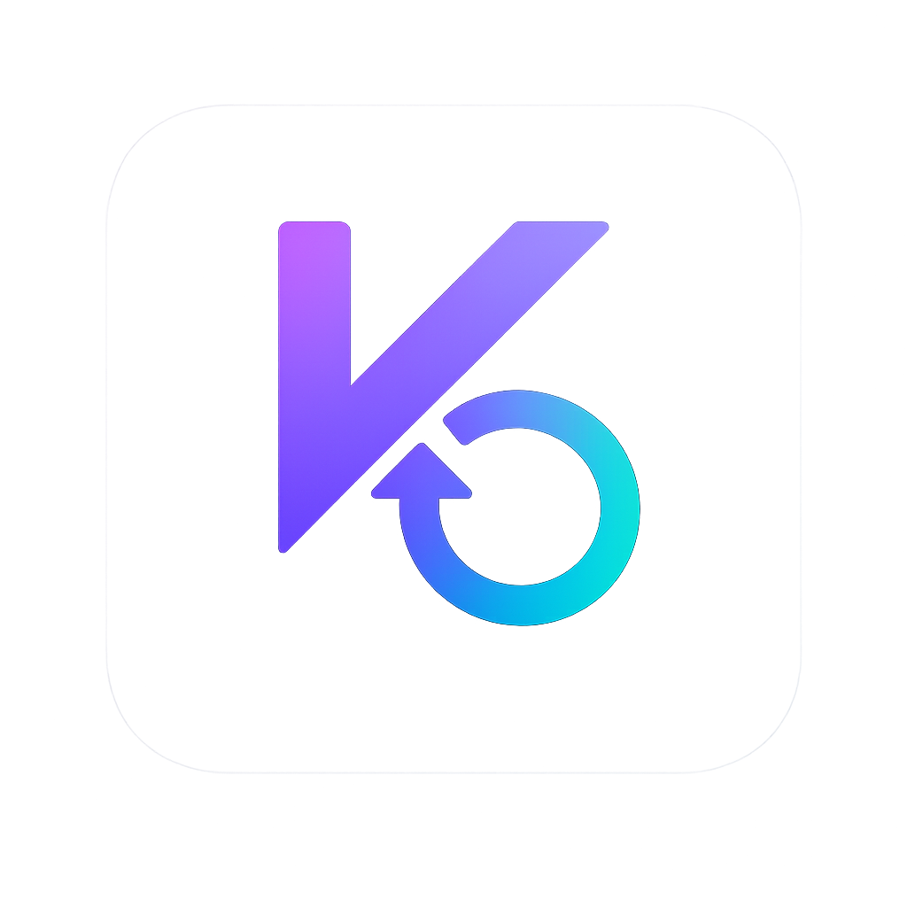

<div align="center">



# Kirby

**Autonomous AI Agent Loop for Kiro CLI**

[](https://opensource.org/licenses/MIT)
[](https://github.com/neosun100/kirby/stargazers)
[](https://github.com/neosun100/kirby/network/members)
[](https://github.com/neosun100/kirby/issues)
[](https://github.com/neosun100/kirby/commits/main)

[](https://kiro.dev/cli/)
[](https://ampcode.com)
[](https://docs.anthropic.com/en/docs/claude-code)
[](https://www.gnu.org/software/bash/)
[](CONTRIBUTING.md)

*Iteratively implements PRD stories until complete — one fresh AI instance per iteration.*

[Quick Start](#-quick-start) · [Usage](#-usage) · [Examples](#-real-world-examples) · [Tips](#-tips--best-practices) · [中文文档](docs/README_CN.md)

</div>

---

## 📖 What is Kirby?

Kirby spawns a fresh AI instance per iteration, picks the next incomplete user story from `prd.json`, implements it, runs quality checks, commits, and moves on. Memory persists across iterations via git history, `progress.txt`, and `prd.json`.

Based on [Geoffrey Huntley's Ralph pattern](https://ghuntley.com/ralph/), redesigned for [Kiro CLI](https://kiro.dev/cli/) with native Custom Agent, Hooks, and Steering integration.

### Architecture

```
┌──────────────────────────────────────────────────────────┐
│                      kirby.sh loop                        │
│                                                           │
│  Iteration 1           Iteration 2           Iteration N  │
│  ┌────────────┐       ┌────────────┐       ┌────────────┐│
│  │ Fresh AI    │       │ Fresh AI    │       │ Fresh AI    ││
│  │             │       │             │       │             ││
│  │ 1. Read PRD │       │ 1. Read PRD │       │ 1. Read PRD ││
│  │ 2. Pick story│      │ 2. Pick story│      │ 2. Pick story││
│  │ 3. Implement│       │ 3. Implement│       │ 3. Implement││
│  │ 4. Test     │       │ 4. Test     │       │ 4. Test     ││
│  │ 5. Commit   │       │ 5. Commit   │       │ 5. Commit   ││
│  │ 6. Update   │       │ 6. Update   │       │ 6. COMPLETE ││
│  └────────────┘       └────────────┘       └────────────┘│
│        │                     │                     │      │
│        ▼                     ▼                     ▼      │
│  ┌──────────────────────────────────────────────────────┐│
│  │           Shared Memory (persisted files)             ││
│  │  📋 prd.json      → story status (TODO/DONE)         ││
│  │  📝 progress.txt  → learnings & context               ││
│  │  📦 git history   → code changes                      ││
│  │  🧠 AGENTS.md     → discovered patterns               ││
│  └──────────────────────────────────────────────────────┘│
└──────────────────────────────────────────────────────────┘
```

### Kirby vs Ralph

| Feature | Ralph | Kirby |
|---------|-------|-------|
| AI Tool | Amp or Claude Code | **Kiro CLI** (+ Amp, Claude) |
| Prompt delivery | Pipe to stdin | Positional arg + agent config |
| Tool permissions | `--dangerously-skip-permissions` | `--trust-all-tools` (granular) |
| Context injection | Manual (AI reads files) | **agentSpawn hook** (automatic) |
| Project knowledge | CLAUDE.md / prompt.md only | **Steering files** + AGENTS.md + Hooks |
| MCP support | Limited | **Native** |

## 📋 Prerequisites

| Requirement | Install |
|-------------|---------|
| [Kiro CLI](https://kiro.dev/cli/) | `curl -fsSL https://cli.kiro.dev/install \| bash` |
| [jq](https://jqlang.github.io/jq/) | `brew install jq` (macOS) / `apt install jq` (Ubuntu) |
| Git | Pre-installed on most systems |

**Optional backends:**

| Tool | Install | Flag |
|------|---------|------|
| [Amp](https://ampcode.com) | See ampcode.com | `--tool amp` |
| [Claude Code](https://docs.anthropic.com/en/docs/claude-code) | `npm i -g @anthropic-ai/claude-code` | `--tool claude` |

## 🚀 Quick Start

```bash
# 1. Clone
git clone https://github.com/neosun100/kirby.git

# 2. Copy to your project
cd your-project
cp /path/to/kirby/{kirby.sh,prompt.md,AGENTS.md} .
cp -r /path/to/kirby/.kiro .kiro
chmod +x kirby.sh

# 3. Create prd.json (edit the example or use the skill)
cp /path/to/kirby/prd.json.example prd.json

# 4. Run!
./kirby.sh
```

## 💻 Usage

```
./kirby.sh [OPTIONS] [max_iterations]

Options:
  --tool kiro|amp|claude   AI tool (default: kiro)
  --help                   Show help

Arguments:
  max_iterations           Max loop count (default: 10)
```

```bash
./kirby.sh                 # Kiro, 10 iterations
./kirby.sh 20              # Kiro, 20 iterations
./kirby.sh --tool amp 5    # Amp, 5 iterations
./kirby.sh --tool claude   # Claude Code, 10 iterations
```

## 🔄 Complete Workflow

### Step 1 — Write a PRD

Use the Kiro skill interactively:

```
> Load the prd skill and create a PRD for adding dark mode to my React app
```

Or write `prd.json` manually:

<details>
<summary>📄 prd.json format (click to expand)</summary>

```json
{
  "project": "MyApp",
  "branchName": "kirby/dark-mode",
  "description": "Add dark mode toggle",
  "userStories": [
    {
      "id": "US-001",
      "title": "Add theme context",
      "description": "As a developer, I need a React context for theme state.",
      "acceptanceCriteria": [
        "ThemeContext provides 'light' and 'dark' values",
        "ThemeProvider wraps the app in _app.tsx",
        "Typecheck passes"
      ],
      "priority": 1,
      "passes": false,
      "notes": ""
    },
    {
      "id": "US-002",
      "title": "Add toggle button to header",
      "description": "As a user, I want a button to switch themes.",
      "acceptanceCriteria": [
        "Toggle button visible in header",
        "Clicking toggles light/dark",
        "Preference persists in localStorage",
        "Typecheck passes"
      ],
      "priority": 2,
      "passes": false,
      "notes": ""
    }
  ]
}
```

</details>

### Step 2 — Convert PRD (optional)

```
> Load the kirby skill and convert tasks/prd-dark-mode.md to prd.json
```

### Step 3 — Run Kirby

```bash
./kirby.sh
```

### Step 4 — Review & Push

```bash
git log --oneline                                          # see commits
cat prd.json | jq '.userStories[] | {id, title, passes}'  # see status
git push origin kirby/dark-mode                            # push
```

## 📚 Real-World Examples

<details>
<summary><b>Example 1: REST API endpoint</b></summary>

```json
{
  "project": "ExpressAPI",
  "branchName": "kirby/user-search",
  "description": "Add user search endpoint",
  "userStories": [
    {
      "id": "US-001",
      "title": "Add search query to user repository",
      "description": "Add a findByName method to the user repository.",
      "acceptanceCriteria": [
        "UserRepository has findByName(query: string) method",
        "Returns users where name contains query (case-insensitive)",
        "Typecheck passes", "Tests pass"
      ],
      "priority": 1, "passes": false, "notes": ""
    },
    {
      "id": "US-002",
      "title": "Add GET /api/users/search endpoint",
      "description": "Expose user search via REST API.",
      "acceptanceCriteria": [
        "GET /api/users/search?q=john returns matching users",
        "Returns 400 if q param missing",
        "Returns empty array if no matches",
        "Typecheck passes", "Tests pass"
      ],
      "priority": 2, "passes": false, "notes": ""
    }
  ]
}
```

</details>

<details>
<summary><b>Example 2: Database migration + UI</b></summary>

```json
{
  "project": "TaskApp",
  "branchName": "kirby/task-tags",
  "description": "Add tagging system to tasks",
  "userStories": [
    {
      "id": "US-001",
      "title": "Create tags table and junction table",
      "description": "Database schema for many-to-many task-tag relationship.",
      "acceptanceCriteria": [
        "tags table with id, name, color columns",
        "task_tags junction table with task_id, tag_id",
        "Migration runs successfully", "Typecheck passes"
      ],
      "priority": 1, "passes": false, "notes": ""
    },
    {
      "id": "US-002",
      "title": "Add tag CRUD server actions",
      "description": "Backend logic for creating, reading, deleting tags.",
      "acceptanceCriteria": [
        "createTag(name, color) works",
        "getTags() returns all tags",
        "deleteTag(id) removes tag and junction entries",
        "Typecheck passes"
      ],
      "priority": 2, "passes": false, "notes": ""
    },
    {
      "id": "US-003",
      "title": "Display tags on task cards",
      "description": "Show assigned tags as colored badges.",
      "acceptanceCriteria": [
        "Tags display as colored badges on task cards",
        "Maximum 3 tags shown, +N for overflow",
        "Typecheck passes"
      ],
      "priority": 3, "passes": false, "notes": ""
    }
  ]
}
```

</details>

<details>
<summary><b>Example 3: Next.js feature with server actions</b></summary>

```json
{
  "project": "SaaSApp",
  "branchName": "kirby/invite-system",
  "description": "Team invitation system",
  "userStories": [
    {
      "id": "US-001",
      "title": "Add invitations table",
      "description": "Schema for pending team invitations.",
      "acceptanceCriteria": [
        "invitations table: id, team_id, email, token, status, expires_at",
        "Migration runs", "Typecheck passes"
      ],
      "priority": 1, "passes": false, "notes": ""
    },
    {
      "id": "US-002",
      "title": "Create invite server action",
      "description": "Server action to create and send invitations.",
      "acceptanceCriteria": [
        "createInvite(teamId, email) creates invitation with unique token",
        "Duplicate email for same team returns error",
        "Typecheck passes", "Tests pass"
      ],
      "priority": 2, "passes": false, "notes": ""
    },
    {
      "id": "US-003",
      "title": "Add invite form to team settings",
      "description": "UI for inviting team members.",
      "acceptanceCriteria": [
        "Email input + Send button in team settings page",
        "Shows success/error toast after submission",
        "Typecheck passes"
      ],
      "priority": 3, "passes": false, "notes": ""
    },
    {
      "id": "US-004",
      "title": "Accept invitation page",
      "description": "Page where invited users accept and join the team.",
      "acceptanceCriteria": [
        "/invite/[token] page shows team name and accept button",
        "Accepting adds user to team and marks invitation as accepted",
        "Expired/invalid tokens show error message",
        "Typecheck passes"
      ],
      "priority": 4, "passes": false, "notes": ""
    }
  ]
}
```

</details>

## 💡 Tips & Best Practices

### Writing Good Stories

| ✅ Do | ❌ Don't |
|-------|---------|
| "Add `status` column with default 'pending'" | "Make the database better" |
| "Button shows confirmation dialog before delete" | "Good UX for deletion" |
| One focused change per story | Multiple unrelated changes |
| Include "Typecheck passes" in every story | Forget quality checks |
| Order by dependency (schema → backend → UI) | Put UI before its backend |

### Sizing Stories

> **Rule of thumb:** If you can't describe the change in 2-3 sentences, split it.

```
❌ "Build the user dashboard"

✅ Split into:
   US-001: Add dashboard route and empty page component
   US-002: Add stats query (total users, active today, new this week)
   US-003: Add stats cards to dashboard page
   US-004: Add recent activity list component
   US-005: Add activity list to dashboard page
```

### Using Steering Files

Create `.kiro/steering/` files to give Kirby project-specific knowledge:

```markdown
<!-- .kiro/steering/tech-stack.md -->
# Tech Stack
- Framework: Next.js 14 with App Router
- Database: PostgreSQL with Drizzle ORM
- Styling: Tailwind CSS
- Always use server actions, not API routes
```

### Recovering from Failures

```bash
# See what happened
cat progress.txt | tail -30

# Option 1: Add hints to the stuck story
jq '.userStories[0].notes = "Use existing Button from src/components/ui"' \
  prd.json > tmp && mv tmp prd.json

# Option 2: Mark as done and move on
jq '.userStories[0].passes = true' prd.json > tmp && mv tmp prd.json

# Option 3: Split into smaller stories (edit prd.json manually)

# Re-run
./kirby.sh
```

### Maximizing Efficiency

1. 📝 **Start with good AGENTS.md** — Add project patterns before the first run
2. 🧭 **Use steering files** — Tell Kirby about your tech stack and conventions
3. ⚛️ **Keep stories atomic** — One change, one test, one commit
4. 🔍 **Review after each feature** — Promote good learnings from progress.txt to AGENTS.md

## ⚙️ How Kiro Integration Works

### Custom Agent

`.kiro/agents/kirby.json` provides:
- **Allowed Tools**: `read`, `write`, `shell` pre-trusted for autonomous operation
- **Resources**: Auto-loads `AGENTS.md` and `.kiro/steering/` files
- **agentSpawn Hook**: Injects git status + PRD progress + recent learnings at startup

### Steering Files

```
.kiro/steering/
├── project.md      # Project conventions
├── tech-stack.md   # Framework/library preferences
└── testing.md      # Testing patterns
```

Kiro automatically loads these into every iteration.

### AGENTS.md

Kiro natively supports the [AGENTS.md standard](https://agents.md/). Kirby updates these files with discovered patterns, and Kiro reads them in future iterations.

## 📁 Project Structure

```
kirby/
├── kirby.sh                    # Main loop script
├── prompt.md                   # Per-iteration AI instructions
├── AGENTS.md                   # Project patterns (Kiro auto-loads)
├── prd.json.example            # Example PRD format
├── .kiro/
│   └── agents/
│       └── kirby.json          # Kiro custom agent config
├── skills/
│   ├── prd/SKILL.md            # PRD generation skill
│   └── kirby/SKILL.md          # PRD → JSON conversion skill
├── docs/
│   └── README_CN.md            # 中文文档
├── CHANGELOG.md
├── CONTRIBUTING.md
├── LICENSE
└── .gitignore
```

## 🐛 Debugging

```bash
# Story status
cat prd.json | jq '.userStories[] | {id, title, passes}'

# What Kirby learned
cat progress.txt

# Git history
git log --oneline -10

# Re-run with more iterations
./kirby.sh 20
```

## 🗄️ Archiving

Kirby automatically archives previous runs when `branchName` changes. Archives go to `archive/YYYY-MM-DD-feature-name/`.

## 🤝 Contributing

See [CONTRIBUTING.md](CONTRIBUTING.md). PRs welcome!

## 📋 Changelog

See [CHANGELOG.md](CHANGELOG.md).

## 📄 License

[MIT](LICENSE) © 2026

## 🔗 References

- [Geoffrey Huntley's Ralph article](https://ghuntley.com/ralph/)
- [Kiro CLI documentation](https://kiro.dev/docs/cli/)
- [Kiro Custom Agents](https://kiro.dev/docs/cli/custom-agents/configuration-reference/)
- [Kiro Steering](https://kiro.dev/docs/cli/steering/)
- [Kiro Hooks](https://kiro.dev/docs/cli/hooks/)

---

<div align="center">

**If Kirby helps you ship faster, give it a ⭐!**

[](https://star-history.com/#neosun100/kirby&Date)

</div>
